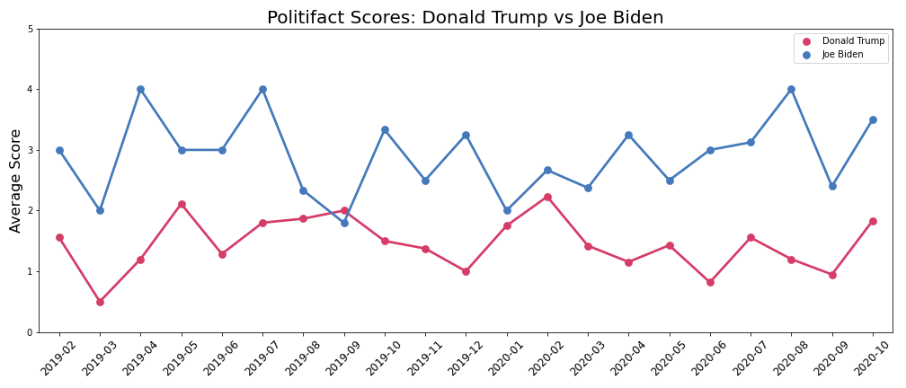
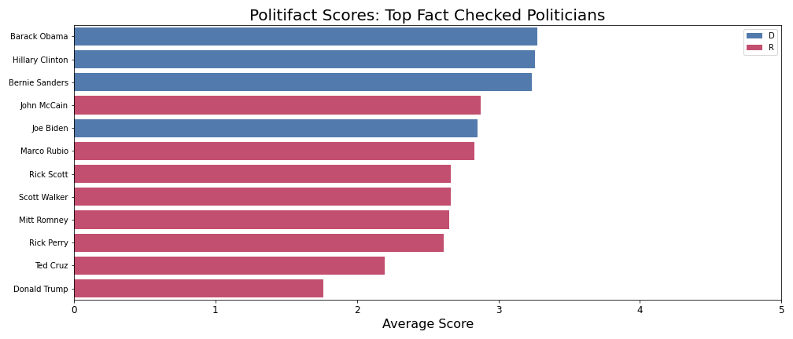
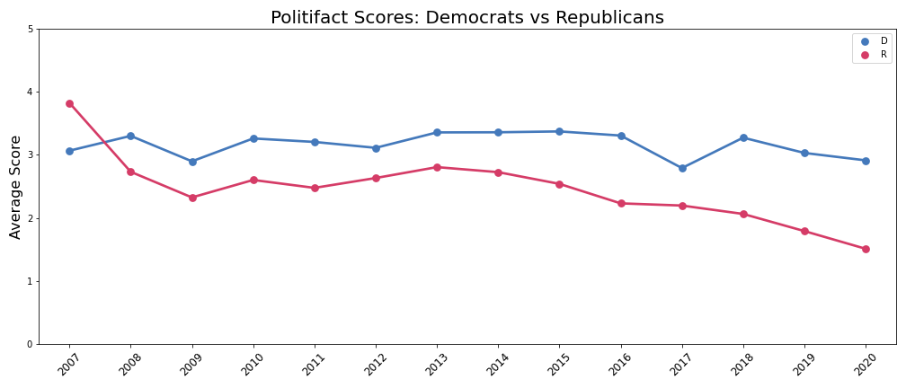

# Fake News - How to Sort Fact from Fiction

_[Ryan Mackie](https://www.linkedin.com/in/ryan-mackie/)_

**Problem Statement**

Along with the presidential election in 2016 came the emergence of fake news, which has become a major problem in our connected world.

The extensive spread of fake news has the potential for extremely negative impacts on individuals and society. Therefore, fake news detection has become an important topic of research in recent years.

The challenge of automatically tagging fake news with out using a real person to cross-check is a huge obstacle, and my objective is to build a model that can accurately predict if a news story is likely to be real or not.

## Executive Summary

**Contents:**

[Data Collection](https://git.generalassemb.ly/rwmackie13/Submissions/blob/master/Projects/capstone-master/01_Data_Collection.ipynb)

[EDA/Visualizations](https://git.generalassemb.ly/rwmackie13/Submissions/blob/master/Projects/capstone-master/02_EDA_Visualizations.ipynb)

[Pre-Processing & Modeling](https://git.generalassemb.ly/rwmackie13/Submissions/blob/master/Projects/capstone-master/03_PreProcessing_Modeling.ipynb)
 
[Modeling New Kaggle Data](https://git.generalassemb.ly/rwmackie13/Submissions/blob/master/Projects/capstone-master/04_Modeling_New_Data_Kaggle1.ipynb)

## Data Acquisition

PolitiFact contains over 17,000 stories that have been fact checked, dating back to November of 2007. For this project, I scraped the entire collection of fact checked articles from PolitiFact - 17,730 articles in total.

Additional data was collected from Kaggle - Fake News. The dataset used contains 20,387 unique stories that have been fact checked from between 2016 and 2018.

## EDA/Visualizations

1. PolitiFact Scores of Presidential Candidates



2. PolitiFact Scores of Top Fact Checked Politicians



3. PolitiFact Scores of Political Parties 



## Installing and steps to run the software:

1. The first step would be to clone this repo in a folder in your local machine.
```
git clone https://github.com/
```

2. Then make sure you have all the dependencies installed.
    - python 3.6+
    - numpy
    - tensorflow
    - keras
    - pandas
    - nltk
    - re

3. In order to run the app script, you will need to make sure Streamlit is installed on your computer. 
```
    pip install streamlit
```

4. After all the files are saved in a folder in your machine, change the directory to the folder where this project is saved.
```
cd C:/your cloned project folder path goes here/
```

5. Run `app.py`

    - To run the final product of this project, I included a file called `app.py`. To use the app, run the file in a text editor or command prompt as `streamlit run app.py`. The user will be prompted to enter the text of a news article. It is important that the user input is just the text from an article and not a link. After the user inputs their text, the text is then determined to be real news or not.

## Sources
**Documentation**

[Streamlit](https://docs.streamlit.io/en/stable/)

[PolitiFact](https://www.politifact.com/factchecks/list/)

[Kaggle](https://www.kaggle.com/search?q=Fake+News+in%3Adatasets)

